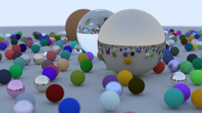

# RayTracingInOneWeekend
手を動かしながら[Ray Tracing in One Weekend series](https://raytracing.github.io/)([日本語版](https://inzkyk.xyz/ray_tracing_in_one_weekend/))を学んでいる記録。



# つまづいた点やメモ
(これissueでやることでは？)
## vec3クラスの実装
一部資料に`return ^this;`とある

- `return *this;`の誤字

## vec3, `inline std::ostream& operator<<`でコンパイルエラー
vec3.hの最後の行に`#endif`を書く

## 球体のレンダリング
赤い球が画面中心ではなく右上に配置される

- `vec3.h`の実装ミス
  - ×`operator/`, 〇`operator/=`
  - `operator*`: 乗算じゃなくて加算してた

## `[hittable.h] sphere`クラス
`hittable.h`に記述するのに`#include "hittable.h"`？

- 資料の誤字(pdf, HTML両方)
- 実際は`sphere.h`にsphereクラスを書く

## hittable_list
実装時に球体がレンダリングできなくなった。

- デバッグプリントで原因特定
  - `main` 球体衝突時のif文の中身が実行されていない
  - `hittable_list::hit` object->hitのif文がtrueにならない
  - `sphere::hit` discriminantは0以上だが、tempとt_max,t_minの比較結果がtrueにならない
  - t_max, t_minの値が異常に低い(6.95e-310, 0)
  - `hittable_list::hit` closest_so_far変数に`temp.rec.t`を入れて、それを`object->hit`のtmaxにしている。
    - ここだった。`auto closest_so_far = temp_rec.t;` => `auto closest_so_far = tmax;`

## `#include エラーが検出されました`
エラーをパッシブで可視化する拡張機能入れていたら`#include (自作ヘッダーファイル)`で上記エラー。includePathを更新してくれと言われる。

`${workplaceFolder}`をincludePathに追加して解決
```
            "includePath": [
                "${workspaceFolder}/**",
                "${workspaceFolder}"
            ],
```

## `ソース ファイルを開けません`(iostream, cmath, memoryなど)
`/usr/include/**`をincludePathに指定しても上記エラーが出る。

- includePathで`/usr/include/**`を設定すると、なぜか`(現在地)/usr/include/**`と同義になる。
- 原因不明。ひとまず無視

## ランバート反射に関して
BRDFを定義して、それに沿って実装しているのとは訳が違う

- 物体表面の法線から単位球を設定
- 新しくレイをサンプリングして方向を取得している
  - つまりランダムな方向にレイを飛ばして表現
- 再帰の部分で0.5かけてるので、反射1回につき光の半分が吸収されるものとみなしている。だから暗くなる？